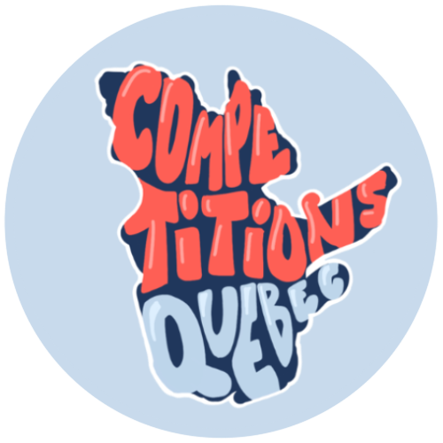

# 📋 About this website

Welcome to Competitions Quebec ! As a student myself, I love to participate in competitions and meet like-minded people, but I sometimes find it hard to find information about them. Whether it is for hackathons, GameJams, CTFs, or other competitions such as CS Games or JDIS Games, I hope this website will serve as a central platform to find such info and share resources. 

We also have a [Discord](https://discord.gg/UYAk93a2ZS) and an [Instagram](https://www.instagram.com/competitionsqc.ca/)!

Constance - Otaphoque 🦭

# 💻 Hackathons

A hackathon is an intensive time-bound event where teams come together to collaborate and create innovative solutions to specific challenges or projects. Typically lasting 24 or 36 hours, hackathons are the perfect opportunity to focus on learning a specific technology. You are sometimes given a problematic or a theme, and you have to come up and build a complete project from scratch.

More resources for hackathons:
- [Devpost](https://devpost.com/): for worldwide, online and/or long-duration hackathons
- [MLH](https://mlh.io/): for more local, hybrid hackathons

# ⛳️ CTFs

A Capture The Flag (CTF) competition is a cybersecurity challenge where participants, sometimes in teams, a cybersecurity simulation. The objective is to find and exploit security vulnerabilities, solve puzzles, and recover hidden pieces of information, known as "flags." CTFs are designed to test and improve the participants' hacking and defensive skills, spanning a wide range of cybersecurity domains, such as web security, cryptography, reverse engineering, and more.

More resources for CTFs:
- [PicoCTF](https://picoctf.org/): to practice CTF beginner-friendly challenges
- [RingZeroCTF](https://ringzer0ctf.com/): to practice CTF advanced challenges
- [CTFTime](https://ctftime.org/): to see all online CTFs happening around the world
- [HackTheBox](https://www.hackthebox.com/): to learn more about cybersecurity in general
- [MontréHack](https://montrehack.ca/): to participate in a monthly CTF solving workshop (in Montreal)

# 🎮 GameJams

Similar to a hackathon, a GameJam is a creative event where game developers, designers, and enthusiasts gather to collaboratively create video games within a constrained period, often lasting anywhere from a few days to a couple of weeks. During a game jam, participants work intensively to design and build games based on a specific theme or set of constraints.

More resources for GameJames:
- [itch.io](https://itch.io/jams): to see all GameJams happening around the world

# 👾 Others

The best category in my opnion. The competitions here are so diverse and original that it's hard to describe them all. Some notable examples inlude: 
- [CS Games](https://csgames.org/) (March): Technical and social computer competition where teams of about ten students from North American universities compete to win the CS Cup. During the three days of the event, there are various 3 to 6-hour competitions covering various computer science domains, a continuous "Puzzle Hero" challenge, extravagant parties, sponsors, and an incredible atmosphere!
- [JDIS Games](https://jdis.ca/) (July): Day-long competition where the goal is to program a bot to make it play (and win?) in a video game specially designed for the occasion
- [ICPC](https://na.icpc.global/nena/) (October): Algorithmic competition where participants have to solve problems by coding algorithms (Leetcode style, just harder)