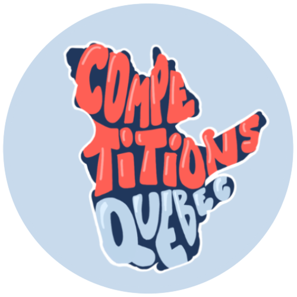

# 📋 A propos du site

Bienvenue sur Compétitions Québec ! En tant qu'étudiante, j'adore participer à des compétitions d'informatique et rencontrer des nouvelles personnes, mais je trouve qu'il est parfois difficile de trouver les bonnes informations. Alors que ce soitpour des hackathons, des gamejams, des CTFs ou même d'autres événements comme les CS Games ou les JDIS Games, j'espère que ce site servira de point central pour s'y retrouver et partager des ressources.

On a aussi un [Discord](https://discord.gg/UYAk93a2ZS) et un [Instagram](https://www.instagram.com/competitionsqc.ca/) !

Constance - Otaphoque 🦭

# 💻 Hackathons

Un hackathon est un événement intensif et limité dans le temps où les participants, en équipe, se réunissent pour collaborer et créer des solutions innovantes à des défis ou des projets spécifiques. Généralement d'une durée de 24 à 36 heures, un hackathon est l'occasion idéale pour se concentrer sur l'apprentissage d'une technologie spécifique. Un thème ou une problèmatique sont parfois donnés, le but est alors de construire un projet de a à z.

Plus de ressources pour les hackathons :
- [Devpost](https://devpost.com/) : pour des hackathons en ligne à l'échelle mondiale, ou d'une durée plus longue
- [MLH](https://mlh.io/) : pour des hackathons hybrides relativement locaux

# ⛳️ CTFs

Une compétition Capture The Flag (CTF) est un défi en cybersécurité où les participants, parfois en équipes, s'affrontent afin de trouver un maximum de flags à travers l'exploitation de vulnérabilité de sécurité, la résolution d'énigmes et la récupération d'informations cachées. Les CTF sont conçus pour tester et améliorer les compétences en piratage et en défense des participants, et couvre un large éventail de domaines de la cybersécurité, tels que le Web, la cryptographie, la rétro-ingénierie, et bien plus encore.

Plus de ressources pour les CTFs :
- [PicoCTF](https://picoctf.org/) : pour pratiquer des challenges de niveau débutant
- [RingZeroCTF](https://ringzer0ctf.com/) : pour pratiquer des challenges de plus haut niveau
- [CTFTime](https://ctftime.org/) : pour voir et participer aux CTFs à échelle mondiale
- [HackTheBox](https://www.hackthebox.com/) : pour apprendre des trucs de cybersécurité en général
- [MontréHack](https://montrehack.ca/) : pour participer à un atelier mensuel de résolution de challenge (à Montréal)

# 🎮 GameJams

Similaire à un hackathon, un GameJam est un événement créatif où les développeurs de jeux, les concepteurs et les passionnés de jeux vidéo se réunissent pour créer collaborativement des jeux vidéo dans une période limitée, souvent allant de quelques jours à quelques semaines. Pendant un GameJam, les participants travaillent intensivement pour concevoir et créer des jeux vidéo basés sur un thème spécifique ou un ensemble de contraintes.

Pour plus de ressources pour les GameJams :
- [itch.io](https://itch.io/jams) : site central pour trouver tous les GameJams internationaux

# 👾 Others

La meilleure catégorie selon moi. Les compétitions ici sont tellement diverses et originales qu'il serait difficile de toutes les décrire, mais voici quelques exemples notables : 
- [CS Games](https://csgames.org/) (Mars) : Compétition d’informatique technique et sociale où des équipes d’une dizaine d’étudiants d’universités nord-américaines s’affrontent pour remporter la CS Cup. Au programme durant les trois jours de l’événement : des compétitions de 3 à 6 heures touchant tous les domaines informatiques, un challenge "Puzzle Hero" en continu, des partys démesurés, des sponsors et une ambiance d’enfer ! 
- [JDIS Games](https://jdis.ca/) (Juillet) : Compétition d'une journée de long, où le but est de programmer un bot pour le faire jouer (et gagner ?) à un jeu vidéo spécialement conçu pour l'occasion.
- [ICPC](https://na.icpc.global/nena/) (Octobre) : Compétition de type algorithmique où il faut résoudre des questions en codant des algorithmes (style Leetcode, juste plus difficile).